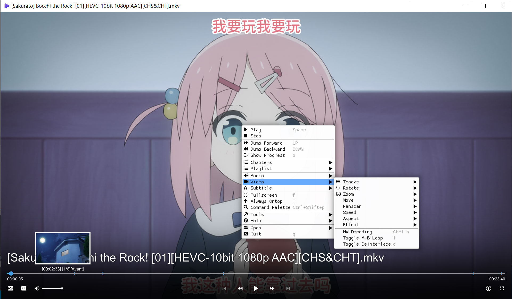
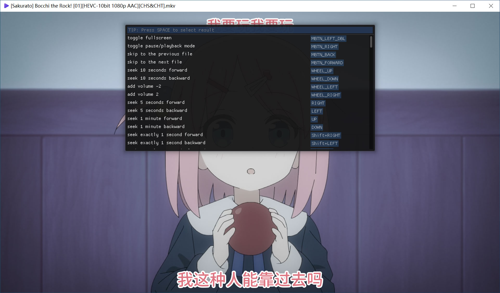
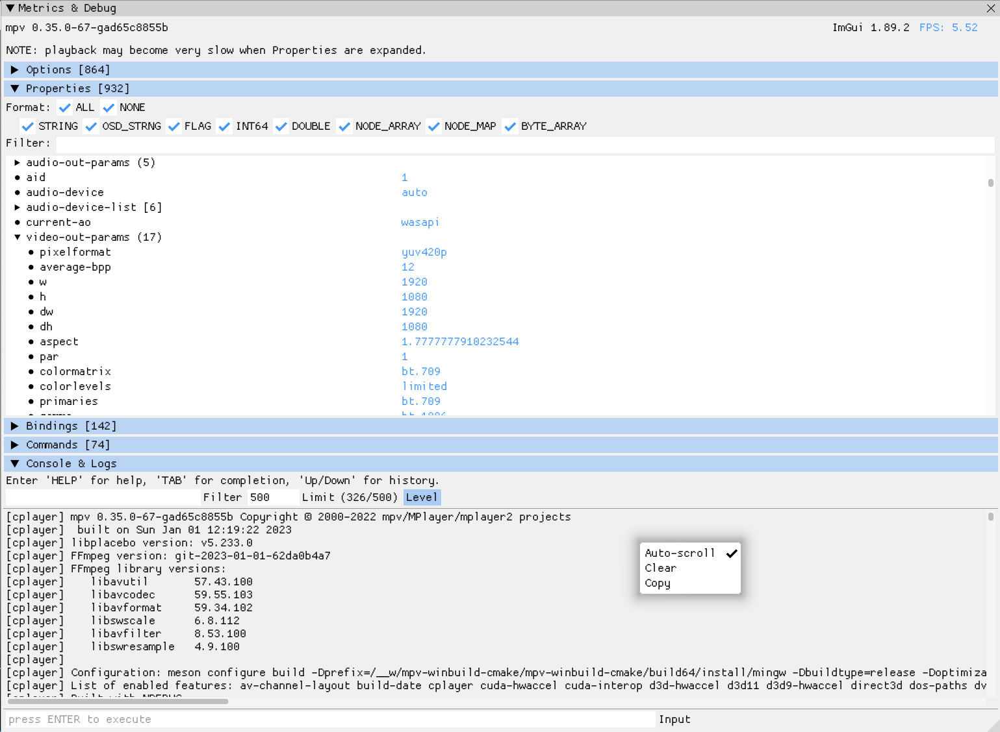

# ImPlay

ImPlay is a Cross-Platform Desktop Media Player, built on top of [mpv](https://mpv.io) and [ImGui](https://github.com/ocornut/imgui).

ImPlay aims to be mpv compatible, which means almost all mpv features from the [manual](https://mpv.io/manual) are (or will be) available.

# Features

- Highly compatible with mpv
  - GPU Video Decoding
  - High Quality Video Output
  - [Lua](https://mpv.io/manual/stable/#lua-scripting) and [Javascript](https://mpv.io/manual/stable/#javascript) Scripting
  - [User Scripts](https://github.com/mpv-player/mpv/wiki/User-Scripts) and [Config Files](https://mpv.io/manual/stable/#configuration-files)
  - [Command Line](https://mpv.io/manual/stable/#usage) Interface
  - [Keyboard / Mouse](https://mpv.io/manual/stable/#interactive-control) Control
  - [On Screen Controler](https://mpv.io/manual/stable/#on-screen-controller) (OSC)
    - Compatible with popular OSC scripts: [mpv-osc-modern](https://github.com/maoiscat/mpv-osc-modern), [thumbfast](https://github.com/po5/thumbfast)
  - Take Video Screenshot
  - Used as Image Viewer
- Graphical User Interface
  - Context Menu with most commonly used commands
  - Command Palette to quickly search commands and keys
  - Open Dialog for Media Files / Folders
  - Open URL / Path from Clipboard
  - Open DVD / Blu-ray Folder and ISO Image
  - Playlist Editing: Add, Clear, Shuffle
  - Shadow and Rounding effect for Interface
- Scripting Developer Friendly
  - Visual view of mpv's internal properties
  - Console with completion, history support
  - Colorful mpv logs view with filter support
- Cross platform: Window, Linux, macOS

# Installation

- Binary version: download from the [Releases](https://github.com/tsl0922/ImPlay/releases) page
- Build from source: check the [Compiling](docs/compiling.md) document

# Screenshots
### Context Menu

### Command Palette

### Quick Settings & Debug

# Credits

ImPlay uses the following libraries, thanks to their authors and contributors.

- [mpv](https://mpv.io): Command line video player
- [imgui](https://github.com/ocornut/imgui): Bloat-free Graphical User interface for C++ with minimal dependencies
  - [stb_image.h](https://github.com/nothings/stb/blob/master/stb_image.h): public domain image loader
- [glfw](https://www.glfw.org): an Open Source, multi-platform library for OpenGL, OpenGL ES and Vulkan development on the desktop
- [glad](https://glad.dav1d.de): Multi-Language GL/GLES/EGL/GLX/WGL Loader-Generator based on the official specs
- [fmt](https://fmt.dev): A modern formatting library
- [json](https://json.nlohmann.me): JSON for Modern C++
- [inipp](https://github.com/mcmtroffaes/inipp): Simple C++ ini parser
- [libromfs](https://github.com/WerWolv/libromfs): Simple library for embedding static resources into C++ binaries using CMake
- [nativefiledialog](https://github.com/btzy/nativefiledialog-extended): Cross platform (Windows, Mac, Linux) native file dialog library 

# License

[GPLv2](LICENSE.txt).
