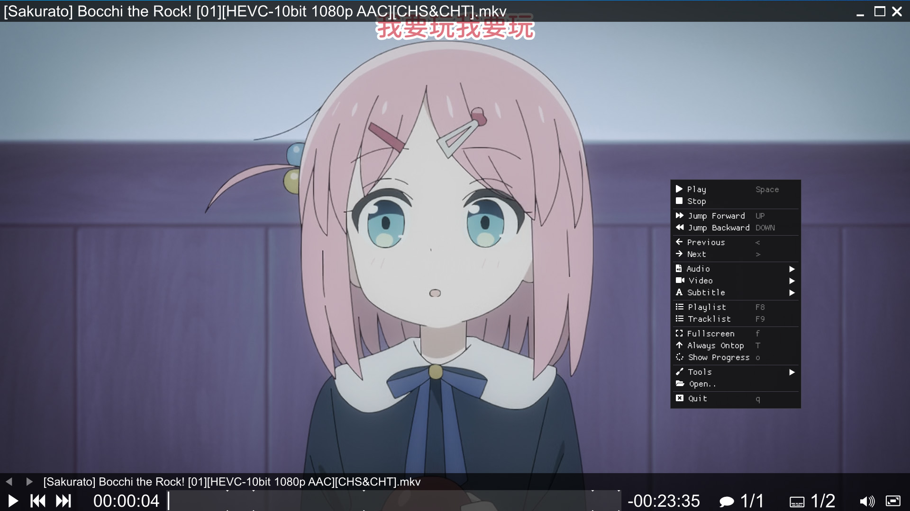

# ImPlay

ImPlay is a work-in-progress cross-platform desktop media player.

ImPlay is built on top of [mpv](https://mpv.io) and [ImGui](https://github.com/ocornut/imgui).

ImPlay aims to be mpv compatible, which means almost all mpv features from the [manual](https://mpv.io/manual) are (or will be) available.

# License

[GPLv2](LICENSE).